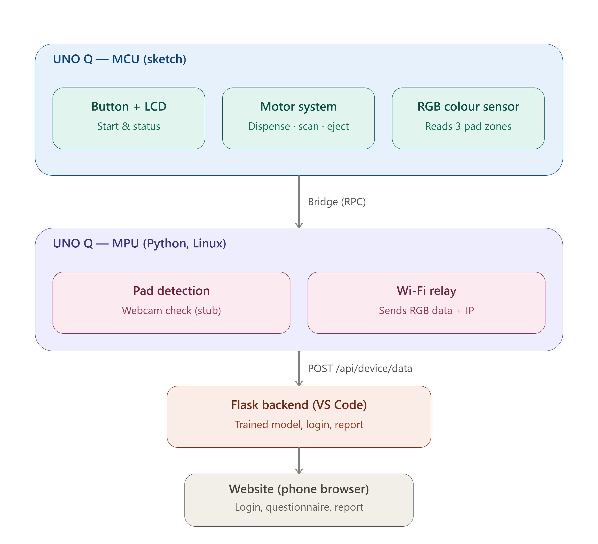
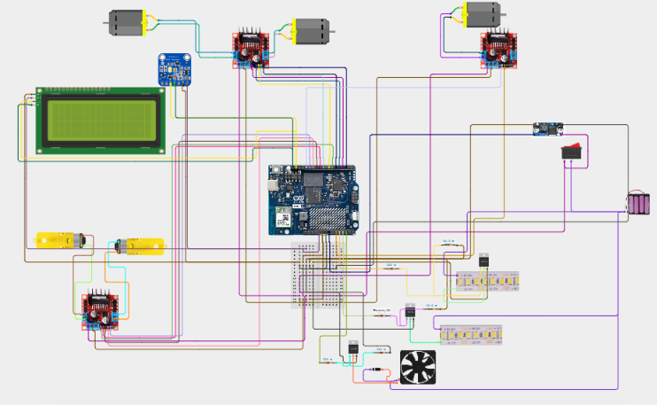

<div align="center">


### Period. Decoded.

A physical-AI menstrual health screening device — a smart pad sensor, a trained
Random Forest model, and a companion website, built end to end by a four-member
all-women engineering team.

[](backend/)
[](arduino_applab/)
[](backend/train_model.py)
[](#license)

</div>

---

## Table of contents

- [Overview](#overview)
- [Screenshots](#screenshots)
- [System architecture](#system-architecture)
- [Hardware](#hardware)
- [How the model works](#how-the-model-works)
- [Repository structure](#repository-structure)
- [Getting started](#getting-started)
- [API reference](#api-reference)
- [Roadmap](#roadmap)
- [Team](#team)
- [License](#license)

---

## Overview

HerPulse is a pad-based screening device that reads three biomarkers —
**hemoglobin, protein, and pH** — from a used pad via an RGB colour sensor,
sends the raw reading to a trained Random Forest model, and turns it into a
plain-language report with a **low / medium / high risk** rating per
parameter and a doctor-visit recommendation when warranted.

- **Hardware**: Arduino UNO Q (MCU sketch + Linux/MPU side via App Lab),
  3 motor drivers, RGB colour sensor, LCD status display, reagent dispensing
  and disposal mechanism.
- **AI**: Random Forest models trained on a 300-sample labeled biomarker
  dataset — one regressor + one classifier per biomarker, plus a
  deterministic diagnosis lookup.
- **Software**: Flask backend + a from-scratch HTML/CSS/JS frontend covering
  the full user flow — splash → login → device connect → questionnaire →
  processing → report.

---

## Screenshots

> Drop your images into `docs/images/website/` and update the paths below —
> they'll render directly here once added.

| Login | Connect device | Report |
|:---:|:---:|:---:|
|  |  |  |

<details>
<summary>Full user flow (click to expand)</summary>

| Splash | Questionnaire | Processing |
|:---:|:---:|:---:|
|  |  |  |

</details>

---

## System architecture

> Drop your exported block diagram into `docs/images/block-diagram/` — the
> image below will pick it up automatically once the filename matches.



**In short:** the UNO Q's MCU side (sketch) handles real-time control —
button, motors, RGB sensor, LCD — and hands a reading to the MPU (Linux)
side over Bridge. The MPU relays it over Wi-Fi to a Flask backend, which
runs the trained model and serves the report to a phone browser.

```
UNO Q (MCU sketch)  →  Bridge (RPC)  →  UNO Q (MPU / Python)
                                              │  Wi-Fi POST
                                              ▼
                                    Flask backend (trained model)
                                              │  HTTP + session
                                              ▼
                                     Website (phone browser)
```

Full breakdown of every route, credential, and file: see
[`docs/BUILD_NOTES.md`](docs/BUILD_NOTES.md) and
[`HARDWARE_INTEGRATION_GUIDE.md`](HARDWARE_INTEGRATION_GUIDE.md).

---

## Hardware

### Circuit diagram

> Drop your circuit exports into `docs/images/circuit/` — supports multiple
> images (main schematic, power section, sensor wiring, etc.).




### 3D enclosure design

> Drop your renders/exports into `docs/images/3d-design/`.

<table>
<tr>
<td></td>
<td></td>
</tr>
<tr>
<td align="center"><sub>Front view</sub></td>
<td align="center"><sub>Exploded view</sub></td>
</tr>
</table>

### Assembled device

> Drop real photos into `docs/images/hardware-photos/`.


### Bill of materials

| Component | Role |
|---|---|
| Arduino UNO Q | MCU (real-time control) + MPU (Linux, Wi-Fi relay) |
| 3× dual motor driver | Syringe/rack-and-pinion (2 motors), RGB scan carriage (1 motor), disposal (2 TT motors) |
| RGB colour sensor (I2C) | Reads pad reagent colour across 3 zones |
| 16×2 parallel LCD | Live status display (`IDLE`, `SCANNING`, `DONE`, etc.) + shows the board's IP on boot |
| 3× MOSFET (TO-220) | Switches fan + 2 LED strips |
| 3-cell battery pack + rocker switch + buck converter | Single shared power source for the whole device |

Full wiring notes, verified vs. still-to-confirm pins, and the reasoning
behind each choice: [`HARDWARE_INTEGRATION_GUIDE.md`](HARDWARE_INTEGRATION_GUIDE.md).

---

## How the model works

Trained on `backend/data/Integrated_Menstrual_Biomarker_Dataset_300_Samples.xlsx`
(300 labeled samples). For each of **Hb, Protein, pH**:

- a **Random Forest regressor** predicts the actual lab value from the raw
  R/G/B sensor triplet
- a **Random Forest classifier** predicts the risk label (e.g. Normal /
  Low / Critical)

The dataset's `Suggested_Health_Issue` column turned out to be fully
deterministic from the three risk labels together (18 unique combinations,
zero conflicts), so instead of a fourth model, that combination is saved as
an exact lookup table — the report's diagnosis text comes straight from the
dataset's own language.

```bash
cd backend
pip install -r requirements-train.txt
python train_model.py data/Integrated_Menstrual_Biomarker_Dataset_300_Samples.xlsx
```

---

## Repository structure

```
herpulse/
├── frontend/                    Website — splash, login, connect, questionnaire, processing, report
│   ├── css/style.css
│   ├── js/api.js
│   └── assets/logo.png
│
├── backend/                     Flask app + trained model
│   ├── app.py                    routes, auth, device connect, inference
│   ├── train_model.py             trains the 3 Random Forests + diagnosis lookup
│   ├── create_user.py             CLI to add/reset a login
│   ├── data/                       labeled biomarker dataset
│   ├── models/                     trained model bundle (.joblib)
│   └── requirements*.txt
│
├── arduino_applab/               UNO Q App Lab code
│   ├── sketch/sketch.ino           MCU: button, motors, RGB sensor, LCD
│   ├── python/main.py               MPU: Bridge relay to Flask, pad-detection hook
│   └── app.yaml
│
├── docs/
│   ├── images/                     ← drop your circuit / block diagram / 3D / screenshots here
│   └── BUILD_NOTES.md               detailed setup + API reference
│
└── HARDWARE_INTEGRATION_GUIDE.md  full wiring + stage-by-stage build order
```

---

## Getting started

```bash
git clone <this-repo-url>
cd herpulse/backend
pip install -r requirements.txt
python app.py
```
Open `http://127.0.0.1:5000/`.

**Demo login:** `demo` / `herpulse123`
**Device connect:** name `HerPulse_Q`, password `Herpulse123`

For the hardware side (Arduino UNO Q + App Lab), see
[`HARDWARE_INTEGRATION_GUIDE.md`](HARDWARE_INTEGRATION_GUIDE.md) for the
full stage-by-stage build order.

---

## API reference

| Route | Method | Purpose |
|---|---|---|
| `/api/login` | POST | `{username, password}` → sets session |
| `/api/device/connect` | POST | `{device_id, device_password}` → handshake |
| `/api/device/data` | POST | Arduino posts raw R/G/B readings here |
| `/api/questions` | GET | the 10 questionnaire items |
| `/api/submit-answers` | POST | `{answers: {...}}` |
| `/api/process/start` / `/api/process/status` | POST / GET | runs + polls the model |
| `/api/report` | GET | metrics, risk levels, diagnosis, suggestions |

Full request/response shapes in [`docs/BUILD_NOTES.md`](docs/BUILD_NOTES.md).

---

## Roadmap

- [ ] Webcam-based pad detection (currently stubbed — see `check_pad()` in `arduino_applab/python/main.py`)
- [ ] Wire real pad sensor readings into the Arduino sketch
- [ ] `/api/history` route + report history view
- [ ] Second dataset: image-based pad identification model
- [ ] Swap Flask's dev server for gunicorn before any public demo

---

## Team

Four-member all-women engineering team, Electronics and Computer Engineering,
Loyola College of Engineering and Technology.

---


